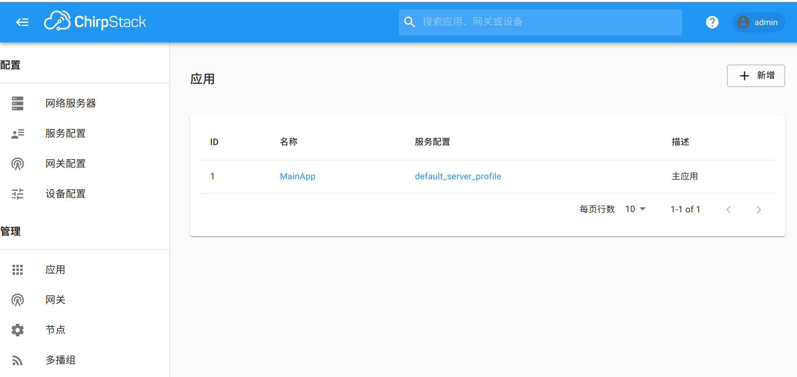
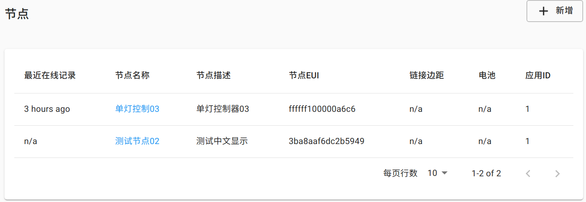
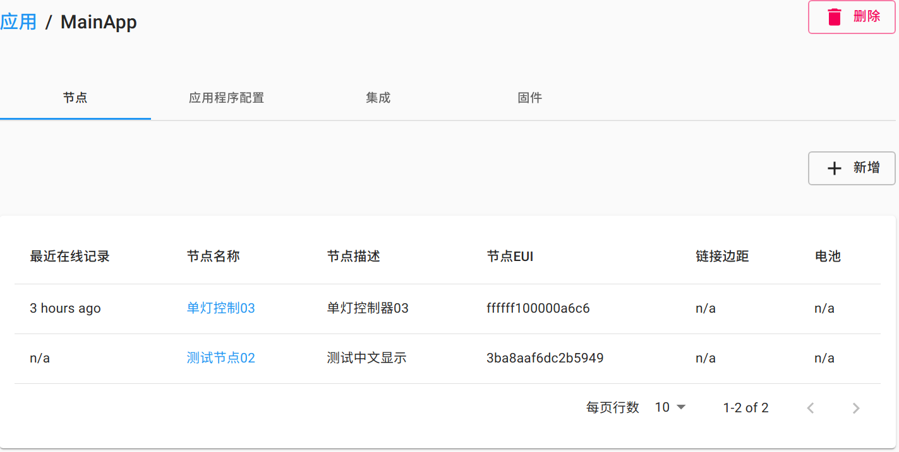
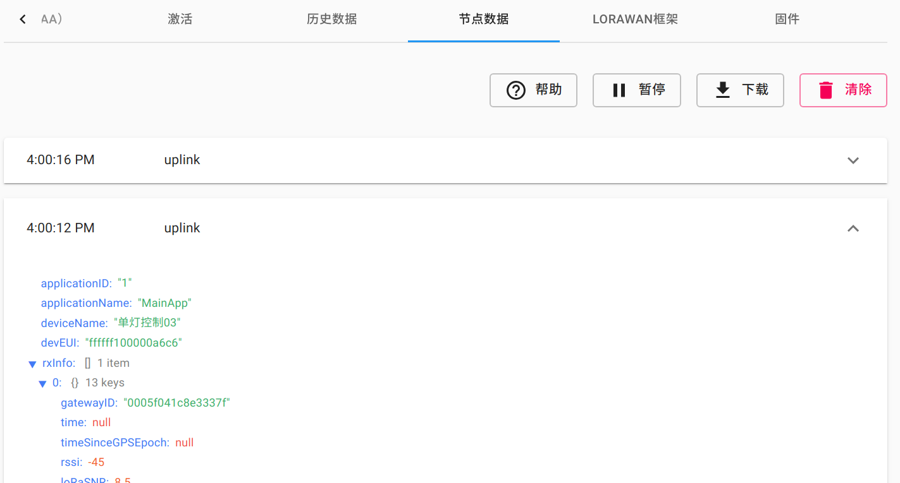
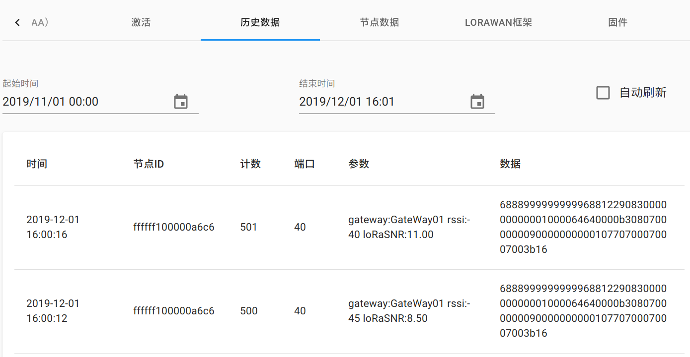
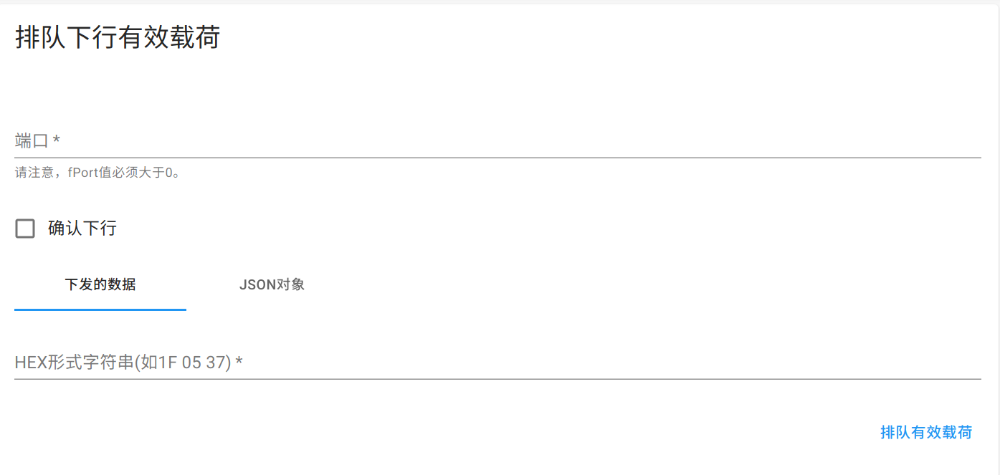
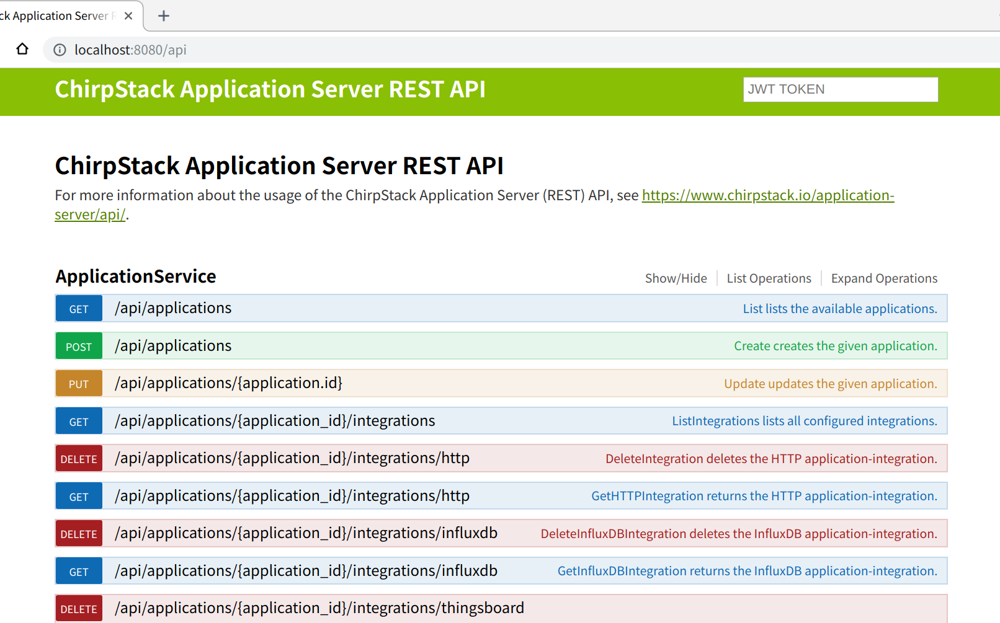
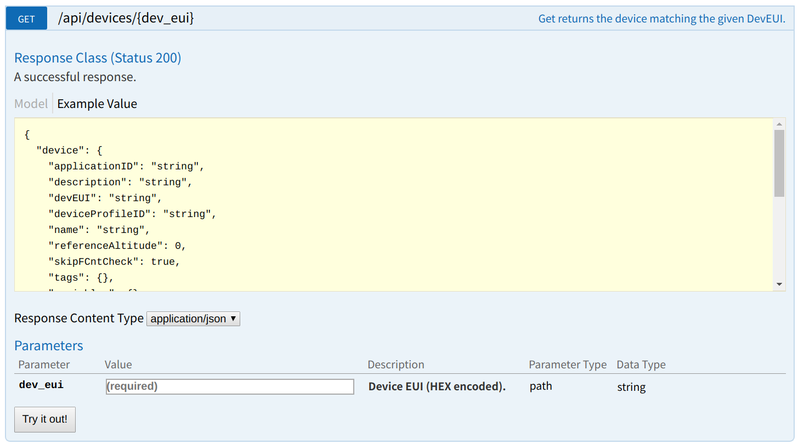
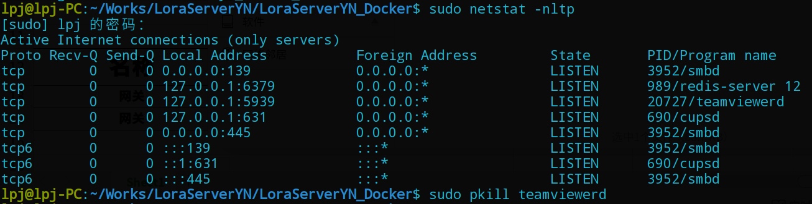

---

| 作者 | 日期 | 版本号 | 邮箱 |
| ---- | ---- | ------ | ---- |
| lpj  | 2020/01/15 | 1.1.7 | 269499391@qq.com |

---


## 一、准备工作、安装和开机自动设置

LoraServerYN_Docker中间件使用docker-compose部署，在linux系统中安装docker和docker-compose后，进入LoraServerYN_Docker文件夹，用命令`docker-compose up`即可启动中间件，下面以Ubuntu 18.04纯净系统(刚安装好的系统，未做任何设置）为例详细讲述：  

### 1.1 更改国内apt源（apt安装软件速度更快）

* 执行下面命令打开`/etc/apt/sources.list`文件，如果提示输入密码就输入当前的用户密码  
  ```shell
  sudo gedit /etc/apt/sources.list
  ```
* 打开文件后，把里面的内容全部删除，复制下面内容并粘贴到文件里（注意每一行都是deb开头，如果复制粘贴过程中换行了，要重新调整一下）
  ```bash
  deb http://mirrors.aliyun.com/ubuntu/ bionic main restricted universe multiverse
  deb http://mirrors.aliyun.com/ubuntu/ bionic-security main restricted universe multiverse
  deb http://mirrors.aliyun.com/ubuntu/ bionic-updates main restricted universe multiverse
  deb http://mirrors.aliyun.com/ubuntu/ bionic-proposed main restricted universe multiverse
  deb http://mirrors.aliyun.com/ubuntu/ bionic-backports main restricted universe multiverse
  deb-src http://mirrors.aliyun.com/ubuntu/ bionic main restricted universe multiverse
  deb-src http://mirrors.aliyun.com/ubuntu/ bionic-security main restricted universe multiverse
  deb-src http://mirrors.aliyun.com/ubuntu/ bionic-updates main restricted universe multiverse
  deb-src http://mirrors.aliyun.com/ubuntu/ bionic-proposed main restricted universe multiverse
  deb-src http://mirrors.aliyun.com/ubuntu/ bionic-backports main restricted universe multiverse
  ```
* 保存文件，执行下面的命令更新软件包信息
  ```bash
  sudo apt update
  ```

### 1.2 安装docker和docker-compose
* 执行下面的命令（如果提示是否安装(y/n),就点一下y键）
  ```bash
  sudo apt install docker docker-compose
  ```

### 1.3 更改docker源为国内源（从docker服务器上下载镜像更快）

* 执行下面的命令打开docker源配置文件
  ```bash
  sudo gedit /etc/docker/daemon.json
  ```

* 打开文件后，复制下面内容粘贴到文件里面并保存
  ```bash
  {
      "registry-mirrors": ["http://hub-mirror.c.163.com"]
  }
  ```

* 执行下面命令重启docker服务
  ```bash
  sudo systemctl restart docker.service
  ```

### 1.4 启动LoraServerYN_Docker

* 将LoraServerYN_Docker.zip解压到任何目录，解压后的完整路径比如为/home/gg/LoraServerYN_Docker，然后执行下面命令（路径根据实际情况更改），切换到LoraServerYN_Docker目录  
  ```bash
  cd /home/gg/LoraServerYN_Docker
  ```

* 执行下面命令启动中间件
  ```bash
  sudo docker-compose up
  ```

* 打开浏览器，输入网址localhost:8080进入中间件登录页面，登录用户名和密码都为admin

* 如果启动出错或者想要重启中间件，先Ctrl-C终止中间件运行，然后分别执行下面的命令重启
  ```bash
  sudo docker-compose down
  sudo docker-compose up
  ```

### 1.5 中间件升级

* 若中间件升级时需要同步（保留）之前的数据，那么在任意路径解压新的中间件后，保持文件夹名跟之前一样如LoraServerYN_Docker，然后执行下面的命令构建新的docker镜像
  ```bash
  sudo docker-compose build
  ```

* 重新构建镜像后，即可像之前一样启动中间件（步骤1.4）

### 1.6 添加开机自启动

* 执行下面命令打开rc.local文件
  ```bash
  sudo gedit /etc/rc.local
  ```

* 打开rc.local文件后，在exit 0上面添加一条命令（根据实际路径更改）
  ```bash
  cd /home/gg/LoraServerYN_Docker;docker-compose up -d
  ```

* 保存文件并关闭，重启电脑测试是否启动成功，可以访问网址localhost:8080进行确认

* 要删除开机自启动，只需重新打开该文件，删掉或注释掉该行命令并保存


## 二、中间件的Web端使用

LoraServerYN_Docker中间件提供两种方式对应用、网关、设备等进行CRUD管理，分别是Web端直接操作和通过编程调用API进行操作，本节就Web端操作进行说明：  
### 2.1 登录

* 启动中间件后，打开浏览器访问`服务器IP:8080`（本机启动可以直接用localhost:8080）可进入中间件的登录页面，输入用户名、密码（都是admin）登录
  

* 登录后，页面左侧导航栏分为上下两个部分，上部为“网络服务器、服务配置、网关配置、设备配置”，对应网关、设备、应用的配置信息，下部为”应用、网关、节点、多播组“，对应应用、网关、节点和多播组的添加、修改、删除和设置等

* **注意：**建议使用chorme、firefox或者Opera等浏览器进行访问，IE浏览器可能显示有错

### 2.2 配置信息

* 中间件在初始化时已经生成了默认的配置信息，正常情况下不用改动或添加新的配置，特殊情况下如有需求，也可以进入对应板块就行改动或添加

### 2.3 应用管理

* **应用列表：**点击左边导航菜单中的”应用“可以打开应用列表页面，能看到现有应用的ID、名称、服务配置和描述，在列表中点击某应用名称可以查看该应用的配置和节点情况，在列表中点击某应用的服务配置可以查看其配置信息

* **添加应用：**在应用列表页面，点击右上角的”新增“按钮打开应用添加页面，输入应用名称、描述，选择对应的配置信息，有效负载编码器保持默认None，然后点击”添加应用“完成添加，应用的ID不可指定，由服务器自动生成

### 2.4 网关管理

* **网关列表：**点击左边导航菜单中的”网关“可以打开网关列表页面，能看到现有网关的名称、ID和活动情况，在列表中点击某网关名称可以查看该网关的详细描述和配置情况

* **添加网关：**在网关列表页面，点击右上角的”新增“按钮打开网关添加页面，输入网关名、网关描述、网关ID，选择网络服务器和网关配置(**注意：网关配置不是必选，通常建议不选，在有实际需求如网关信道特殊等情况下可以先创建网关配置然后创建网关时选择该配置文件**)，然后点击页面最下方的”添加网关“，完成网关添加
  **注意：**此处添加网关只是把网关信息加入到中间件，若要实现网关跟中间件通信，还需通过网关自带的配置系统将其Lora服务器配置成本中间件运行的电脑IP

* **修改网关：**在网关列表页面，点击要修改的网关名进入其详细描述页面，然后点击上方的”网关配置“标签打开该网关配置信息页面，修改名称、描述、配置新后点击页面最下方的”更新网关“，完成网关修改

### 2.5 节点管理

#### 2.5.1 节点列表

* **全部节点列表：**点击左边导航菜单中的”节点“可以打开全部节点列表页面（”全部“是指该中间件数据库中的全部节点，可能包含多个应用），能查看节点的最近在线时间、节点名称（支持中文显示）、节点描述、节点ID、所属应用ID等，如下图：
  


* **应用节点列表：**在应用列表（见2.3）页面点击某应用名称进入其详细信息页面，可以查看该应用下的所有节点，如下图：
  

#### 2.5.2 添加节点

在”全部节点列表“和“应用节点列表”页面都可以进行节点添加，区别是在全部节点列表页面添加时需要指定应用，现以此为例讲述节点添加步骤：

* 在“全部节点列表”页面点击右上角的“新增”按钮打开节点添加页面

* 输入节点名称、节点描述、节点描述、节点EUI（即DevEUI、节点ID），根据节点入网类型选择节点配置（如ABP、OTAA)，选择应用（在应用节点列表添加节点无需此选择，因为已经关联应用），禁用帧计数器验证保持默认，然后点击下方的“添加节点”按钮

* 根据选择的节点配置（ABP、OTAA）会进入对应的信息完善页面，ABP入网的需要输入节点地址DevAddr、网络会话密钥nwkSKey、应用会话密钥appSKey，若该节点之前曾入网且未清空计数器，还需要设置下行帧计数器为对应值（接近该节点之前入网时的下方计数），然后点击“（重新）激活节点”完成添加；OTAA入网的需要在信息完善页面输入应用密钥appKey，Gen应用密钥保持默认，然后点击“设置节点密钥”完成添加

#### 2.5.3 节点数据查看

节点数据支持实时查看和历史数据查看两种模式，分别如下：

* **实时数据查看：**在节点列表页面点击某节点名进入该节点的详情页面，然后点击上部的“节点数据”标签，打开实时数据查看，保持该页面，有上行新数据到来时会以列表展示，点击某数据记录可以展开其Json形式，如下图：
  

* **历史数据查看：**在节点列表页面点击某节点名进入该节点的详情页面，然后点击上部的“历史数据”标签，打开历史数据查看，选择起始时间和结束时间，页面会根据选择的时间提取该节点的历史数据并展示，也可以勾选右边的“自动刷新”复选框，页面会每30秒自动刷新一次数据，每次刷新都会将结束时间更新成当前时间，如下图：
  

* **注意：**在数据量极大的情况下，建议不要将起始时间和结束时间设置得相隔太久，因为数据量太大会导致页面渲染很慢

#### 2.5.4 下发数据到节点

打开节点详情页面（在节点列表页面点击节点可打开详情页面），然后下拉到页面中间，可以看到“排队下行有效载荷”模块（如下图），通过以下步骤下发数据：
  

* **端口：**输入端口号，范围是1-233，若节点要求指定端口号则以设备要求为准

* **确认下行：**该选项主要是设置下发数据中的确认标识，若勾选该选项，则中间件会要求节点收到数据后回复一个ACK包，一般可以不选

* **HEX形式的字符串：**要下发的实际数据，用空格分隔16进制字符串，如FF 07 12 FA

* 完善上述信息后，点击“排队有效载荷”将数据下发到节点


## 三、中间件的接口(MQTT、API）使用

除了在网页上对应用、网关、设备等进行管理外，中间件还提供了一套完整的API接口和MQTT服务供程序调用，以便进行前端开发或集成到其他管理系统中，下面分别对两种接口进行说明

### 3.1 API

打开网址：`xxx.xxx.xxx.xxx:8080/api`（其中xxx.xxx.xxx.xxx为中间件运行的计算机IP）可打开中间件API页面，如下图：
    

该页面展示中间件所有的API列表，按内容分为应用服务、节点服务、网关服务、用户服务等几大类，点击某API可以展开显示该API的route、请求和响应格式，以及测试演示，如点击展开`DeviceService`中的`/api/devices/{dev_eui}`，详细信息如下：
  

根据信息知道这是一个接受GET请求的API，参数为节点ID（dev_eui），得到的返回值为JSON格式的节点信息，**值得注意的是：**，在调用API前，需要先通过`api/internal/login`登录获取有效token（jwt），之后调用API时在header字段加入该jwt，否则中间件会认为API请求未授权

### 3.2 MQTT

中间件提供的MQTT服务主要是供程序订阅节点消息或者向节点下发消息，登录信息、Topic等详述如下：

#### 3.2.1 MQTT登录信息

| 字段   | 内容   |
| ------ | ------ |
| 主机   | 中间件运行所在的计算机IP |
| 端口   | 1883  |
| 用户名 | admin |
| 密码 | qbxx908 |
| ClientID | 任意字符串 |

#### 3.2.2 主题（Topic）格式

目前支持的Topic如下：
```bash
uplink_topic="application/{{ .ApplicationID }}/node/{{ .DevEUI }}/rx"
downlink_topic="application/{{ .ApplicationID }}/node/{{ .DevEUI }}/tx"
join_topic="application/{{ .ApplicationID }}/node/{{ .DevEUI }}/join"
ack_topic="application/{{ .ApplicationID }}/node/{{ .DevEUI }}/ack"
error_topic"application/{{ .ApplicationID }}/node/{{ .DevEUI }}/error"
status_topic"application/{{ .ApplicationID }}/node/{{ .DevEUI }}/status"
location_topic"application/{{ .ApplicationID }}/node/{{ .DevEUI }}/location"
```

使用最多前两个`uplink_topic`和`downlink_topic`分别是订阅节点上传消息和下发消息到节点，对topic的几点说明如下：

* {{ .ApplicationID }}为节点所属的应用ID（注意是ID，不是名称），{{ .DevEUI }}为节点ID（也称节点EUI或DevEUI），比如要订阅应用ID为1下的节点ID为ffffff100000a6c6的节点上传消息，则订阅的Topic为：`application/1/node/ffffff100000a6c6`

* Topic支持`#`和`+`通配，其中`#`通配后面所有层，`+`通配一层，所以要订阅ID为1的应用下的所有节点的所有消息，可以将订阅Topic：`application/1/#`，要订阅该应用下的所有节点的上传消息，可以订阅`application/1/+/rx`

* 当订阅带通配符的Topic时，接收消息回调函数里要先对收到的Topic进行解析，以确定是哪个节点上传的消息

* 节点上传的消息和向节点下发的消息都是JSON格式的字符串，其中的data字段是原始数据进行BASE64编码得到的字符串，接收到消息后首先要对字符串进行BASE64解码才能得到节点数据，下发数据到节点也一样，要先将数据进行BASE64编码，然后和端口号、确认下行标识等一起打包成JSON格式下发，下发数据示例如下：
  ```python
  {
     'devEUI':'ffffff100000a6c6',
     'fPort':2,
     'confirmed':False,
     'data':'aAAAAAAAAAAAAWgAAQIAAAANBBY='
  }
  ```


## 四、中间件常见问题

### 4.1 docker-compose up启动报错

若中间件启动报错，要根据错误信息来定位原因，一般常见的就是端口被占用或者文件路径不存在，这两种问题定位和解决办法是：

* 端口被占用
  中间件运行需要用到8080、1700、5432、1883等端口，若这些端口被别的程序占用，中间件会启动不成功并提示相应信息，这时要先用nestat命令查看端口占用情况，然后pkill掉对应的程序，再重启中间件即可，下图演示了使用netstat查看端口并pkill掉teamviewerd程序的过程：
  

* 文件路径不存在
  这种情况很少出现，排除是认为故意删除相关文件的情况下，一般是文件属性的问题，比如可执行程序因为在windows下打开过导致没有了-x属性等，要根据错误信息找到对应的文件，然后用ls -l查看文件属性，然后用chmod命令修改，比如给文件a增加可执行权限的命令为：
  ```bash
  chmod +x a
  ```

### 4.2 怎么直接查看中间件数据库中的数据

一般来说不建议直接操作中间件数据库中的数据，如果确有需要，可以用postgresql数据库的客户端工具进行连接，LoraServerYN_Docker中间件的数据库中包含三个库，其作用、用户名、密码见下表：（**再次强调**:不建议对中间件的数据库进行操作）
| 数据库名 | 存储内容 | 用户名 | 密码 |
| -------- | -------- | ------ | ---- |
| chirpstack_ns | 网络服务相关信息 | chirpstack_ns | chirpstack_ns |
| chirpstack_as | Web端配置信息 | chirpstack_as | chirpstack_as |
| chirpstack_as_events | 设备数据信息 | chirpstack_as_events | chirpstack_as_events |

### 4.3 怎么完全卸载中间件

中间件不需要卸载，如果以后不用了，可以先在/etc/rc.local文件中删掉启动信息，然后将中间件文件夹删掉即可


